# System Architecture of `msi-rs`

`msi-rs` is an industrial-grade, memory-safe, pure-Rust implementation of the Microsoft Windows Installer technology stack. It provides complete cross-platform tooling, readers, writers, compilers, execution runtimes, and graphical/terminal user interfaces across Linux, macOS, FreeBSD, illumos/Solaris, and Windows.

This document provides a comprehensive technical reference for the architecture, physical container representations, relational database schemas, compilation pipelines, transactional execution lifecycles, cross-platform operating system abstractions, and foreign language bindings comprising `msi-rs`.

---

## Table of Contents

1. [High-Level Architectural Overview](#1-high-level-architectural-overview)
2. [Workspace Organization & Crate Topology](#2-workspace-organization--crate-topology)
3. [Container & Storage Layer Subsystems](#3-container--storage-layer-subsystems)
   - [Compound File Binary Format ([MS-CFB]) Engine](#compound-file-binary-format-ms-cfb-engine)
   - [Microsoft Cabinet (CAB) Archive Engine](#microsoft-cabinet-cab-archive-engine)
4. [Relational Database Subsystem & SQL Engine](#4-relational-database-subsystem--sql-engine)
   - [System Catalogs & Physical Layout](#system-catalogs--physical-layout)
   - [Dual-Stream String Pool](#dual-stream-string-pool)
   - [Standard Schema Taxonomy](#standard-schema-taxonomy)
   - [Embedded SQL Dialect & AST Executor](#embedded-sql-dialect--ast-executor)
   - [IDT Table Serialization & Transforms (`.mst`)](#idt-table-serialization--transforms-mst)
5. [WiX Toolset Pipeline (`candle`, `light`, `dark`, `wix`)](#5-wix-toolset-pipeline-candle-light-dark-wix)
   - [Preprocessor Engine](#preprocessor-engine)
   - [XML Parser & Compiler (`candle` Parity)](#xml-parser--compiler-candle-parity)
   - [Intermediate Object Model (`.wixobj`)](#intermediate-object-model-wixobj)
   - [Linker, Symbol Graph Solver & Binder (`light` Parity)](#linker-symbol-graph-solver--binder-light-parity)
   - [Built-In Internal Consistency Evaluators (ICE)](#built-in-internal-consistency-evaluators-ice)
   - [Decompilation, Harvesting, Patching & Libraries](#decompilation-harvesting-patching--libraries)
6. [Execution Engine & Two-Phase Transaction Lifecycle](#6-execution-engine--two-phase-transaction-lifecycle)
   - [Command-Line Interface Parity (`msiexec.exe`)](#command-line-interface-parity-msiexecexe)
   - [Property Scoping & Condition Evaluation](#property-scoping--condition-evaluation)
   - [Volume Costing Engine](#volume-costing-engine)
   - [Two-Phase Execution Model & Typestate Safety](#two-phase-execution-model--typestate-safety)
   - [Privileged Worker Boundary, Escalation & IPC](#privileged-worker-boundary-escalation--ipc)
   - [Physical Rollback Quarantine (`.rbf`) & Unwinding](#physical-rollback-quarantine-rbf--unwinding)
   - [Custom Action Dispatcher & Script Runtimes](#custom-action-dispatcher--script-runtimes)
7. [Cross-Platform OS Translation Layer (`msi-platform`)](#7-cross-platform-os-translation-layer-msi-platform)
   - [Standard Directory Path Translation](#standard-directory-path-translation)
   - [POSIX Permissions, SDDL Translation & ACLs](#posix-permissions-sddl-translation--acls)
   - [Service Supervision (systemd, launchd, rc.d, SMF)](#service-supervision-systemd-launchd-rcd-smf)
   - [Desktop Integration & Launcher Synthesis](#desktop-integration--launcher-synthesis)
   - [ACID Registry Emulation (SQLite WAL)](#acid-registry-emulation-sqlite-wal)
8. [User Interface & Presentation Subsystems](#8-user-interface--presentation-subsystems)
   - [Headless UI Engine & State Machine](#headless-ui-engine--state-machine)
   - [Dialog Math, Font Rasterization & Layout](#dialog-math-font-rasterization--layout)
   - [Desktop Native GUI Runtime (`msi-gui`)](#desktop-native-gui-runtime-msi-gui)
   - [Terminal Text Wizard (`msi-gui-tui`)](#terminal-text-wizard-msi-gui-tui)
9. [Language Bindings & Foreign Function Interfaces](#9-language-bindings--foreign-function-interfaces)
   - [C-ABI Shared Library (`msi-ffi`)](#c-abi-shared-library-msi-ffi)
   - [Native Python Extension (`msi-python`)](#native-python-extension-msi-python)
10. [Design Patterns, Safety Guarantees & Quality Mandates](#10-design-patterns-safety-guarantees--quality-mandates)

---

## 1. High-Level Architectural Overview

The Windows Installer architecture is traditionally a tightly coupled Win32 system service (`msiserver`), OLE Compound File storage layer, relational database engine, cabinet decompressor, and Win32 UI framework.

`msi-rs` decomposes this system into a clean, layered, memory-safe architecture written from first principles in Rust. The stack eliminates all runtime dependencies on Windows operating systems, the Microsoft .NET Framework, or compatibility runtimes like Wine.

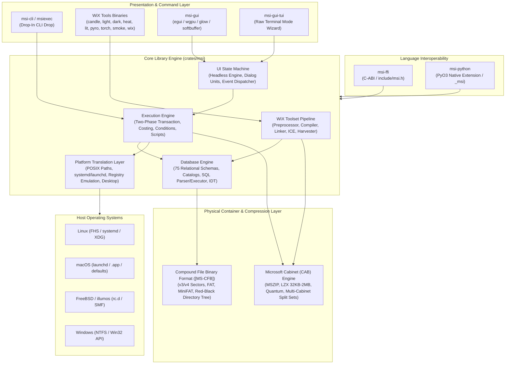

---

## 2. Workspace Organization & Crate Topology

The `msi-rs` project is configured as a high-cohesion Cargo workspace consisting of five specialized crates:

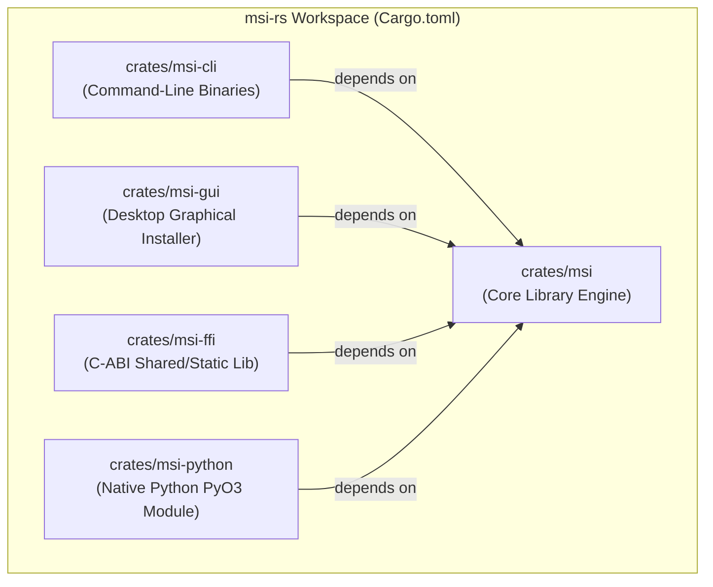

### Crate Responsibilities

| Crate Path | Target Output | Primary Responsibilities |
| :--- | :--- | :--- |
| `crates/msi` | `libmsi.rlib` | Core implementation: [MS-CFB] container, CAB compression algorithms, relational database tables, SQL parser/executor, WiX compilation/linking pipeline, two-phase transaction execution engine, POSIX translation, and headless UI engine. |
| `crates/msi-cli` | 15 Native Binaries | Drop-in replacement for `msiexec.exe` and full suite of standalone WiX executables: `msi-cli`, `candle`, `light`, `dark`, `heat`, `lit`, `pyro`, `smoke`, `torch`, `wix`, `msiinfo`, `msibuild`, `msidump`, `msidiff`, `msiextract`. |
| `crates/msi-gui` | Native Binary `msi-gui` | Interactive cross-platform desktop wizard application powered by `egui` and `eframe`. Supports `wgpu`, `glow`, and pure CPU `softbuffer` rasterizer backends with `AccessKit` screen-reader integration. |
| `crates/msi-ffi` | `libmsi_ffi.so` / `.dylib` / `.a` | C-compatible Foreign Function Interface with C header (`include/msi.h`). Exposes handle-based APIs for C, C++, Go, C#, Swift, and Zig with strict panic isolation boundaries (`catch_unwind`). |
| `crates/msi-python` | `_msi` (C-Extension) | Native Python 3 extension built with PyO3. Exposes object-oriented package creation, version parsing, inspection, and WiX compilation directly to Python codebases. |

---

## 3. Container & Storage Layer Subsystems

Windows Installer files (`.msi`, `.msm`, `.msp`, `.mst`) are structured storage files complying with Microsoft specifications. At the physical layer, `msi-rs` implements pure-Rust readers, writers, and stream allocators.

### Compound File Binary Format ([MS-CFB]) Engine

The Compound File Binary Format (specified in **[MS-CFB]**) acts as an in-file virtual filesystem consisting of structured sectors, allocation tables, and directory entries arranged in a Red-Black balanced tree.

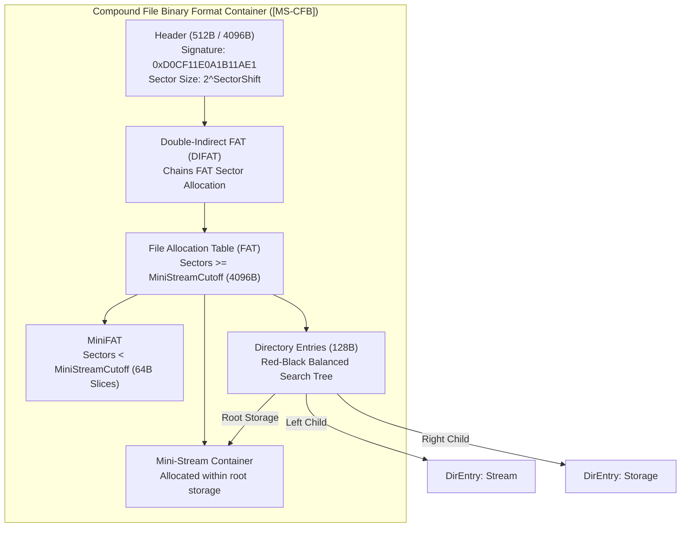

#### Key Technical Invariants in `cfb`
1. **Header Validation**:
   - Signature: Exact byte sequence `0xD0, 0xCF, 0x11, 0xE0, 0xA1, 0xB1, 0x1A, 0xE1`.
   - Byte Order Marker: `0xFFFE` (Little-Endian).
   - Major Versions: Supports Version 3 (512-byte sector, 64-byte mini sector) and Version 4 (4096-byte sector).
   - CLSID: Verified to be all zeroes.
2. **Directory Tree Red-Black Balancing**:
   - Each directory entry occupies exactly 128 bytes.
   - Child entries (`dirid`) are arranged in an ordered binary tree sorted using standard CFB string comparison: comparing UTF-16 character codes case-insensitively for ASCII uppercase/lowercase conversions.
   - Node color flags (`ColorFlag::Red = 0`, `ColorFlag::Black = 1`) maintain tree balance.
3. **MSI Stream Name Compression / Mangling**:
   - Table streams in MSI databases are encoded to fit within the 31-character limit of CFB directory names.
   - Prefix character `!` (ASCII `0x21`) or `0x4840` is prepended for table streams.
   - Compression combines pairs of 6-bit characters into 12-bit code points selected from a 64-character alphabet subset (`0-9`, `A-Z`, `a-z`, `_`, `.`).
   - Special streams (`\005SummaryInformation`, `\005DigitalSignature`) retain standard OLE Property Set prefixes.

---

### Microsoft Cabinet (CAB) Archive Engine

Cabinet archives store the compressed payloads of MSI packages, either embedded as internal CFB streams (e.g. `#cab1.cab`) or as external `.cab` files.

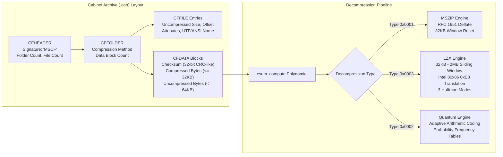

#### Compression Engine Specifications
- **Polynomial Checksum (`csum_compute`)**:
  - Validates `CFDATA` block integrity using Microsoft's specialized cumulative 32-bit checksum algorithm (`CSUMCompute`).
- **MSZIP Decompressor**:
  - Implements RFC 1951 DEFLATE decompression preceded by a two-byte magic header `0x43, 0x4B` (`CK`).
  - Resets the 32KB sliding history dictionary at each `CFDATA` block boundary.
- **LZX Engine**:
  - Sliding history window ranges from 32KB ($2^{15}$ bits) to 2MB ($2^{21}$ bits).
  - Intel 80x86 call instruction translation (`0xE8` translation preprocessing and postprocessing) detects `CALL` offsets and translates absolute addresses to relative offsets for improved compression entropy.
  - Three distinct block Huffman tree codings: Verbatim (Type 1), Aligned Offset (Type 2), and Uncompressed (Type 3).
- **Quantum Engine**:
  - Adaptive arithmetic range coder maintaining dynamically adjusted cumulative symbol frequency distribution models across blocks.
- **Multi-Cabinet Split Sets**:
  - Full support for multi-volume media splitting across multiple disks (`szCabinetPrev`, `szCabinetNext`).
  - Handles folder continuation boundaries (`IFOLDER_PREV`, `IFOLDER_NEXT`, `IFOLDER_SPANS`).
  - Media prompt callback abstractions supporting physical CD-ROM (650MB/700MB) and DVD (4.7GB) layout budgets.

---

## 4. Relational Database Subsystem & SQL Engine

The Windows Installer database is a fully relational database implemented on top of CFB stream storage.

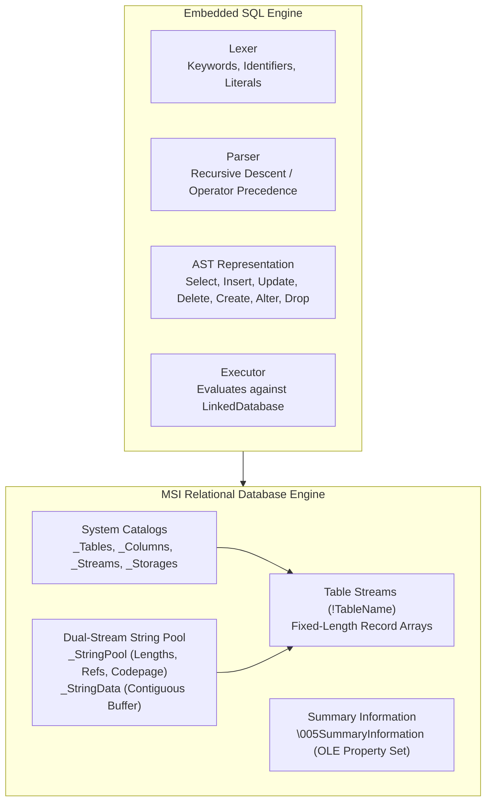

### System Catalogs & Physical Layout
- **`_Tables`**: Contains the names of all persistent tables in the database.
- **`_Columns`**: Stores metadata for every column across all tables: Table Name, Column Number, Column Name, and Column Bitmask Type.
- **`_Streams`**: Index of embedded binary data streams stored directly in the CFB container.
- **`_Storages`**: Index of nested sub-storages (used for transform files and nested installations).

### Dual-Stream String Pool
All strings in the database are deduplicated and managed via two coordinated streams:
1. **`_StringPool`**: A sequence of 4-byte entries. The first entry is the codepage header (`0x0000`, followed by the codepage, such as Windows-1252 or UTF-8 `65001`). Subsequent entries store the byte length and reference count for each string ID.
2. **`_StringData`**: A raw byte stream containing concatenated string characters without null terminators.

### Standard Schema Taxonomy
`msi-rs` defines all **75 standard and extended database table schemas**, strongly typed with compile-time descriptors:

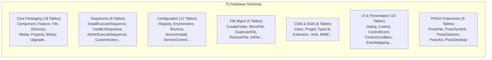

### Embedded SQL Dialect & AST Executor
`msi-rs` includes a dedicated SQL parser and execution engine that adheres to the Win32 MSI SQL syntax:
- **Supported Statements**: `SELECT [DISTINCT]`, `INSERT INTO`, `UPDATE`, `DELETE FROM`, `CREATE TABLE`, `ALTER TABLE`, `DROP TABLE`, `HOLD`, `FREE`.
- **Filtering & Expressions**: Complex `WHERE` clauses supporting `AND`, `OR`, `NOT`, `IS NULL`, `IS NOT NULL`, `=`, `<>`, `<`, `>`, `<=`, `>=`, and `LIKE` pattern matching.
- **Execution Target**: Operates directly over the in-memory `LinkedDatabase` structure, validating foreign keys, column data types, and primary key constraints.

### IDT Table Serialization & Transforms (`.mst`)
- **IDT Architecture**: Reads and writes standard tab-delimited text representations (`.idt`) matching the Windows Installer SDK specification. Lines 1–3 define column names, type definitions (`s<len>`, `i2`, `i4`, `v0`, etc.), and table/primary key declarations, followed by tab-delimited row records.
- **Database Transforms (`.mst`)**:
  - Generates relational diffs between two `LinkedDatabase` instances.
  - Produces structured `TableTransform` operations: added tables, dropped tables, and row-level operations (`Insert`, `Delete`, `Modify`).
  - Supports SDK transform validation masks (`MSITRANSFORM_VALIDATE_PRODUCT`, `UPGRADECODE`, `MAJORVERSION`, etc.).
  - Serializes into CFB transform files or applies `.mst` packages onto existing databases in real time.

---

## 5. WiX Toolset Pipeline (`candle`, `light`, `dark`, `wix`)

`msi-rs` implements a drop-in replacement for the WiX toolchain, compiling declarative WiX XML source documents into final MSI installation packages without requiring the .NET Framework or Windows SDKs.

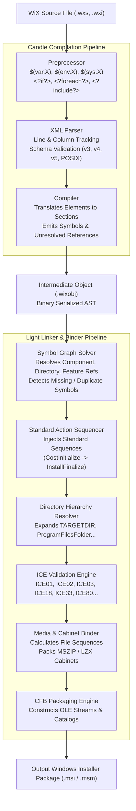

### Preprocessor Engine
- **Variable Expansions**: Dynamically resolves variables from three scopes:
  - `$(var.NAME)`: User-defined preprocessor variables.
  - `$(env.VAR)`: Host environment variables.
  - `$(sys.CURRENTDIR)`: Intrinsic system and compiler properties.
- **Conditional Directives**: Evaluates nested `<?if?>`, `<?elseif?>`, `<?else?>`, and `<?endif?>` directives supporting literal string comparisons, numerical evaluations, and variable existence checks (`$(var.BuildType) = "Release"`).
- **Looping & File Inclusions**: Recursively processes `<?include path/to/file.wxi?>` and `<?foreach var in list?>` loops.

### Intermediate Object Model (`.wixobj`)
The compiler transforms preprocessed XML trees into an intermediate binary or XML format (`WixObject`):
- **Sections (`IntermediateSection`)**: Logical units (`Product`, `Fragment`, `Module`) containing table rows and symbol definitions.
- **Symbols (`Symbol`)**: Typed identifiers declared by a section (e.g. `Component:MainExecutable`, `Directory:INSTALLDIR`).
- **References (`Reference`)**: Unresolved symbol dependencies that must be bound during linking.

### Linker & Symbol Graph Solver
1. **Entry Point Identification**: Begins linking from root sections (`Product` or `Module`).
2. **Graph Resolution**: Traverses all outgoing `Reference` edges, pulling in required fragments from across compiled `.wixobj` files and `.wixlib` libraries.
3. **Standard Action Sequencing**: Automatically injects standard actions (`CostInitialize`, `FileCost`, `CostFinalize`, `InstallValidate`, `InstallFiles`, `RegisterProduct`, `InstallFinalize`) into the sequence tables with canonical order numbers.
4. **Media Binding**: Allocates sequence numbers to all files across `Media` entries, builds embedded or external CAB archives, and embeds them into the database.

### Built-In Internal Consistency Evaluators (ICE)
`msi-rs` eliminates the requirement for external `darice.cub` evaluation by implementing native pure-Rust ICE validation rules directly in the linker:
- **`ICE01`**: Validates basic database integrity, table catalogs, and string pool consistency.
- **`ICE02`**: Validates circular references in the `FeatureComponents` table.
- **`ICE03`**: Validates table field data types, primary keys, string lengths, and nullability constraints.
- **`ICE04`**: Verifies that `File` sequence numbers are unique and contiguous.
- **`ICE05`**: Checks for orphaned records in child tables.
- **`ICE08`**: Validates component GUID formats and casing.
- **`ICE18`**: Verifies that KeyPaths for components are valid and belong to the component.
- **`ICE33`**: Validates registry table entries and root keys.
- **`ICE80`**: Validates 64-bit component assignments and system directories.
- **`ICE99`**: Verifies directory tree hierarchy and ensures a single root `TARGETDIR`.

### Decompilation, Harvesting, Patching & Libraries
- **`dark` (Decompiler)**: Reverse-engineers an existing `.msi` package, decompiling CFB streams, tables, and embedded cabinets back into clean WiX source XML (`.wxs`).
- **`heat` (Harvester)**: Recursively scans filesystem directories or registry trees, automatically generating WiX fragments containing `Directory`, `Component`, and `File` elements.
- **`lit` (Library Builder)**: Packs multiple `.wixobj` intermediate files into a single `.wixlib` archive.
- **`torch` & `pyro` (Patching Engine)**: Diffing engine computes binary file deltas using in-memory byte comparison, generates `.wixmst` transforms, and packages differential update packages (`.msp`).

---

## 6. Execution Engine & Two-Phase Transaction Lifecycle

The `msi-rs` execution engine replaces `msiexec.exe` with a complete, cross-platform runtime implementing the official Windows Installer two-phase execution lifecycle.

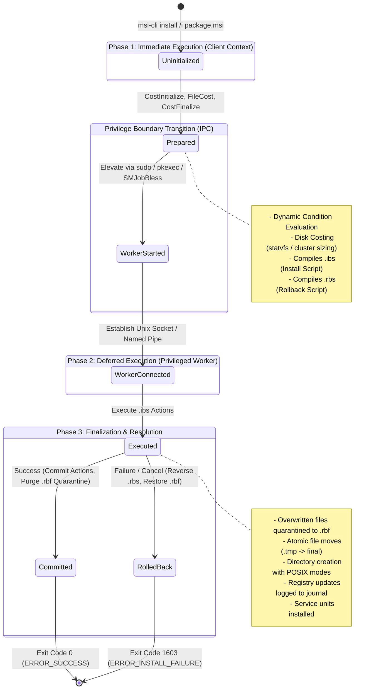

### Two-Phase Execution Model & Typestate Safety
To guarantee that transactions cannot be executed out of order or without proper preparation, `msi-rs` utilizes the **Typestate Pattern**:

```text
Transaction<Uninitialized> -> Transaction<Prepared> -> Transaction<Executed> -> Transaction<Committed> | Transaction<RolledBack>
```

#### Phase 1: Immediate Execution (Client Context)
- Runs without administrative privileges.
- Walks the sequence tables (`InstallExecuteSequence`, `AdminExecuteSequence`).
- Evaluates dynamic action conditions using the `EvaluationContext`.
- Calculates disk space requirements across target volumes via `DiskCostEngine`.
- Generates two synchronized execution scripts:
  1. **`.ibs` (Install Script)**: Ordered operations required to install the software (`ScriptOp::InstallFile`, `ScriptOp::WriteRegistry`, `ScriptOp::CreateDirectory`, `ScriptOp::StartService`).
  2. **`.rbs` (Rollback Script)**: Compensating operations required to restore the system if an error occurs (`RollbackOp::RestoreFile`, `RollbackOp::DeleteFile`, `RollbackOp::RestoreRegistry`, `RollbackOp::StopService`).

#### Phase 2: Deferred Execution (Privileged Worker Context)
- Runs in an isolated, elevated process.
- Receives the compiled scripts over a secure IPC boundary.
- Applies modifications to the physical host filesystem, registry, and service supervisor.

#### Physical Rollback Quarantine (`.rbf`) & Unwinding
- **Quarantine Storage**: Before any existing file on the filesystem is overwritten or modified, the worker moves the original file into a secure quarantine directory as a `.rbf` (Rollback File).
- **Atomic File Staging**: New files are decompressed into temporary files (`.tmp.{uuid}`) within the target directory and atomically renamed to their destination path using filesystem-level atomic rename operations.
- **Rollback Execution**: If any action fails or the user cancels the installation, the engine halts execution and immediately replays the `.rbs` script in **reverse chronological order**. Newly created files and directories are deleted, and quarantined `.rbf` files are restored to their original paths.

### Privileged Worker Boundary, Escalation & IPC

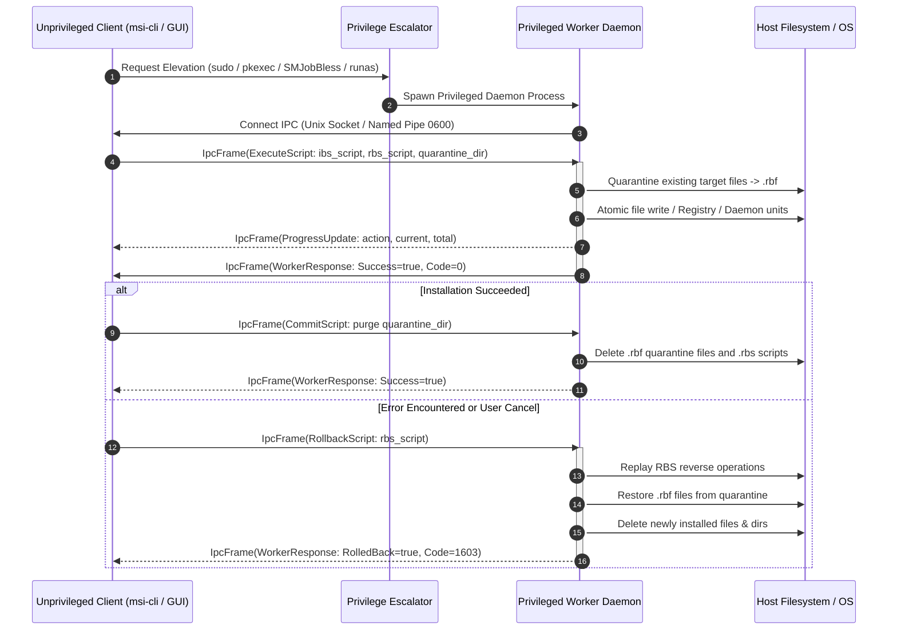

- **IPC Protocol Framing**: Communication over IPC uses a binary framing protocol:
  - 4-Byte Magic Header (`0x4D, 0x53, 0x49, 0x57` - "MSIW").
  - 4-Byte Big-Endian Frame Payload Length.
  - 4-Byte CRC32 Checksum verifying payload data integrity.
  - Serialized message payload (`WorkerIpcMessage`).

### Custom Action Dispatcher & Script Runtimes
`msi-rs` supports all standard MSI Custom Action types:
- **Execution Modes**: In-Script Immediate, Deferred, Rollback, and Commit.
- **Script Engines**:
  - Embedded ECMAScript / JScript interpreter (`JScriptEngine`).
  - Embedded VBScript interpreter (`VBScriptEngine`).
  - Implements the Windows Installer COM Automation `Session` object model (`Session.Property`, `Session.EvaluateCondition`, `Session.Message`, `Session.Mode`).
  - Enforces deterministic fuel/step limits (`DEFAULT_SCRIPT_FUEL = 100,000`) to prevent runaway infinite loops.
- **Native Dynamic Action Loader**:
  - Dynamically loads native libraries (`.so`, `.dylib`, `.dll`) via `dlopen` or `LoadLibraryW`.
  - Executes entry point routines conforming to `UINT __stdcall CustomAction(MSIHANDLE hInstall)`.
  - Emulates core Win32 MSI API handles: `MsiGetPropertyW`, `MsiSetPropertyW`, `MsiProcessMessage`, `MsiCreateRecord`, `MsiRecordGetStringW`, `MsiRecordSetStringW`, `MsiCloseHandle`.
  - Sandboxes native execution inside child processes to isolate memory faults or abort signals from terminating the main installer process.

---

## 7. Cross-Platform OS Translation Layer (`msi-platform`)

Because Windows Installer was designed around Win32 filesystem paths, Windows registry keys, and Windows NT services, `msi-rs` provides an abstraction layer translating these primitives to POSIX and Unix-like operating systems.

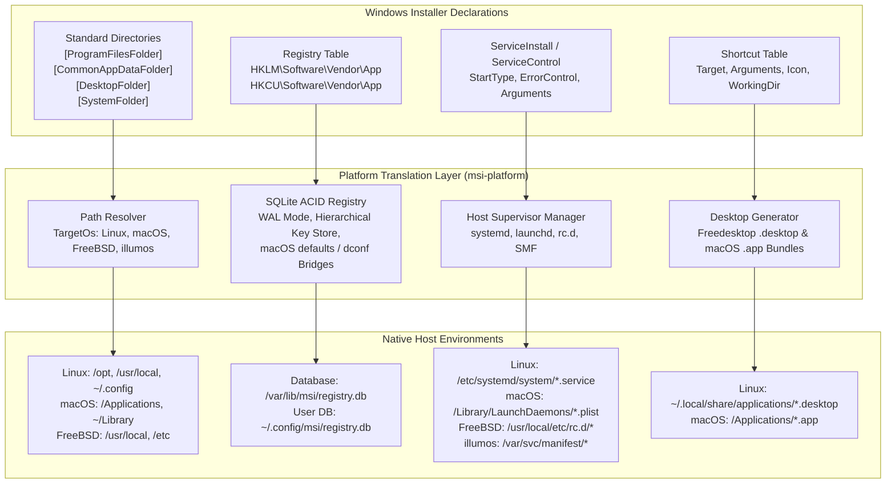

### Standard Directory Path Translation
The `PathResolver` maps standard Windows directory identifiers based on target operating system conventions:

| Standard Directory ID | Windows Path Equivalent | Linux (FHS / XDG) | macOS (Apple File System) |
| :--- | :--- | :--- | :--- |
| `[ProgramFilesFolder]` | `C:\Program Files (x86)` | `/opt` or `/usr/local` | `/Applications` |
| `[ProgramFiles64Folder]` | `C:\Program Files` | `/opt` or `/usr/local` | `/Applications` |
| `[CommonAppDataFolder]` | `C:\ProgramData` | `/var/lib` | `/Library/Application Support` |
| `[LocalAppDataFolder]` | `C:\Users\<user>\AppData\Local` | `~/.local/share` | `~/Library/Application Support` |
| `[AppDataFolder]` | `C:\Users\<user>\AppData\Roaming` | `~/.config` | `~/Library/Preferences` |
| `[DesktopFolder]` | `C:\Users\<user>\Desktop` | `~/Desktop` | `~/Desktop` |
| `[SystemFolder]` | `C:\Windows\System32` | `/usr/local/lib` | `/usr/local/lib` |

### POSIX Permissions, SDDL Translation & ACLs
- Translates Windows Security Descriptor Definition Language (SDDL) syntax (e.g. `D:(A;;GA;;;BA)(A;;GR;;;WD)`) into POSIX permission modes and Access Control Lists (`AclEntry`).
- Native octal permission modes (`0o755`, `0o644`, `S_ISUID`, `S_ISGID`, `S_ISVTX`) applied via `LiveSecurityApplier`.
- Preserves and restores extended filesystem attributes (`xattr`).

### Service Supervision (systemd, launchd, rc.d, SMF)
`HostSupervisorExecutor` inspects the host operating system and translates MSI `ServiceInstall` and `ServiceControl` rows into native daemon configurations:
- **Linux (`systemd`)**: Generates `.service` unit files with `[Unit]`, `[Service]`, and `[Install]` sections. Manages execution via `systemctl daemon-reload`, `systemctl start`, `systemctl stop`, and `systemctl enable`.
- **macOS (`launchd`)**: Generates Apple Property List (`.plist`) daemon configurations with `Label`, `ProgramArguments`, and `RunAtLoad` dictionaries. Manages execution via `launchctl load`, `launchctl unload`, and `launchctl kickstart`.
- **FreeBSD (`rc.d`)**: Generates `rc.subr` scripts located in `/usr/local/etc/rc.d/`, managing lifecycle via `sysrc` and `service`.
- **illumos / Solaris (`SMF`)**: Generates XML service manifests, importing via `svccfg import` and managing through `svcadm enable` / `disable`.

### Desktop Integration & Launcher Synthesis
- **Freedesktop (`.desktop`)**: Converts MSI `Shortcut` entries into standard XDG `.desktop` files written to `/usr/share/applications` or `~/.local/share/applications`. Automatically extracts embedded icon bitmaps and installs them into the XDG hicolor icon theme hierarchy.
- **macOS (`.app` Bundles)**: Synthesizes fully structured macOS application bundles (`AppName.app/Contents/MacOS/AppName`, `Info.plist`, `Resources/AppIcon.icns`).

### ACID Registry Emulation (SQLite WAL)
Because non-Windows operating systems lack a system registry, `msi-rs` provides an ACID registry emulation engine:
- Backed by an embedded SQLite store (`/var/lib/msi/registry.db` for machine entries and `~/.config/msi/registry.db` for user entries).
- Operates in Write-Ahead Logging (WAL) mode for concurrent reader/writer isolation.
- Tables index root keys (`HKEY_LOCAL_MACHINE`, `HKEY_CURRENT_USER`, `HKEY_CLASSES_ROOT`, `HKEY_USERS`), subkeys, value names, types (`REG_SZ`, `REG_DWORD`, `REG_BINARY`, `REG_MULTI_SZ`, `REG_EXPAND_SZ`), and raw data.
- Bridges values to desktop settings stores: syncs `HKEY_CURRENT_USER` configuration to macOS `defaults write` domains and Linux `dconf` / `gsettings` schemas.

---

## 8. User Interface & Presentation Subsystems

The user interface subsystem is architected around a headless, stateful UI engine completely decoupled from graphical or terminal rendering backends.

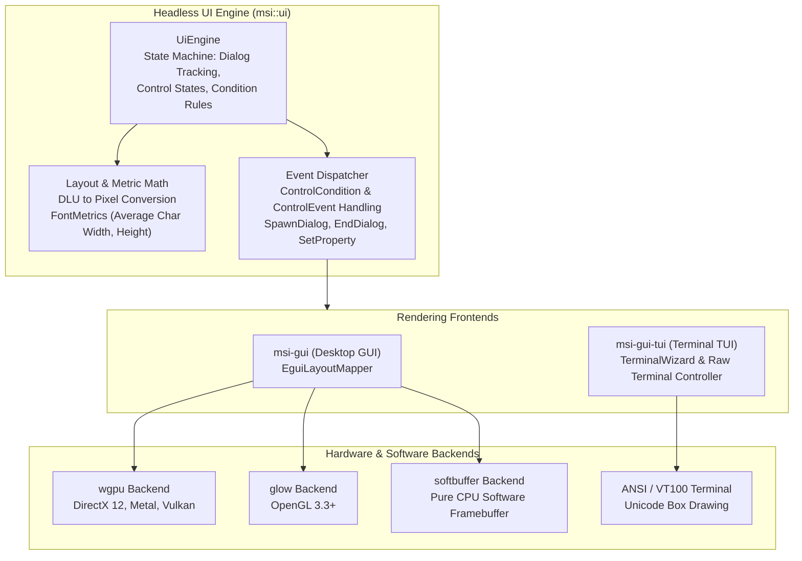

### Headless UI Engine & State Machine
- **State Machine**: Maintains active dialog instances, control runtime states (enabled, disabled, visible, hidden, focused), and text values.
- **Dialog Units (DLU) Translation**: Windows Installer specifies dialog layouts in Dialog Units based on system font metrics. The `FontMetrics` engine accurately translates DLUs to pixel dimensions:

  ```text
  Pixel_X = (DLU_X * AverageCharWidth) / 4
  Pixel_Y = (DLU_Y * FontHeight) / 8
  ```

- **Dynamic Condition & Event Dispatching**: Evaluates `ControlCondition` rules (`Hide`, `Show`, `Enable`, `Disable`) against the active `EvaluationContext`. Evaluates `ControlEvent` actions (`NewDialog`, `SpawnDialog`, `EndDialog`, `SetProperty`, `Reset`).
- **Volume Costing Presentation**: Integrates directly with `DiskCostEngine`, formatting disk requirements for display in `VolumeCostList` controls.

### Desktop Native GUI Runtime (`msi-gui`)
- Built on `eframe` and `egui`.
- Provides WiX style presets out of the box (`WixUI_Mondo`, `WixUI_InstallDir`, `WixUI_FeatureTree`, `Minimal`).
- Multi-backend rendering: hardware-accelerated GPU pipelines (`wgpu`, `glow`) with fallback to pure CPU software rasterization (`softbuffer`) for headless cloud instances or virtual environments without GPU drivers.
- **Accessibility Integration**: Integrates with `AccessKit` to publish accessible node trees to operating system screen readers (VoiceOver on macOS, Orca on Linux, Narrator on Windows).

### Terminal Text Wizard (`msi-gui-tui`)
- Enables interactive graphical-style installations over SSH sessions or in headless server environments.
- Implements raw-mode terminal management with ANSI/VT100 escape sequences.
- Double-buffered virtual terminal screen (`TerminalBuffer`) with Unicode box-drawing primitives, interactive buttons, input text fields, radio lists, and live action progress bars.
- Protected by `TerminalSafetyGuard` using RAII drop mechanics to ensure the host terminal's raw mode, alternate screen buffer, and cursor visibility are always restored even if a process terminates unexpectedly.

---

## 9. Language Bindings & Foreign Function Interfaces

To allow non-Rust applications to inspect, build, and execute Windows Installer packages, `msi-rs` provides native bindings with strict boundary isolation.

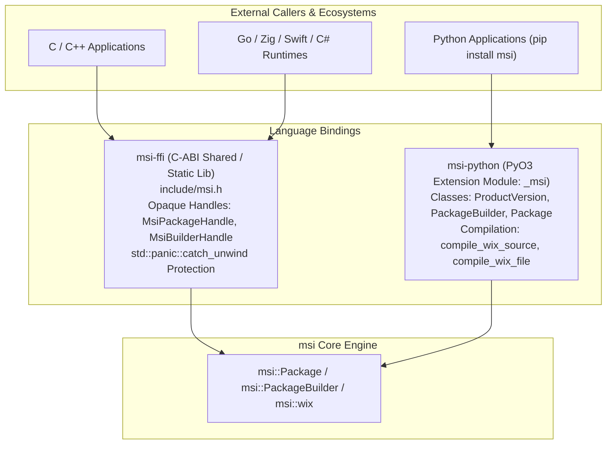

### C-ABI Shared Library (`msi-ffi`)
- **Header File**: Distributed with `include/msi.h`.
- **Opaque Handle Model**: Exposes heap-allocated structs behind opaque pointer types (`MsiPackageHandle`, `MsiBuilderHandle`).
- **Panic Boundary Safety**: Every exported `extern "C"` function is wrapped in `std::panic::catch_unwind`. Unhandled Rust panics cannot cross the C-ABI boundary and are safely caught, returning `MSI_ERROR_PANIC (-99)`.
- **Return Codes & Memory Lifecycle**: Standard integer error codes (`MSI_SUCCESS`, `MSI_ERROR_NULL_POINTER`, `MSI_ERROR_INVALID_ARGUMENT`). Explicit deallocation functions (`msi_string_free`, `msi_package_close`, `msi_builder_free`).

### Native Python Extension (`msi-python`)
- Implemented using PyO3, targeting Python 3.9+ with `abi3` wheel compatibility.
- Exposes native classes:
  - `ProductVersion(major, minor, build)`: Version validation and comparison.
  - `PackageBuilder()`: Fluent builder for creating complete `.msi` packages.
  - `Package.open(path)`: Full package inspection, stream listing, table querying, and file extraction.
  - `compile_wix_source(xml)` & `compile_wix_file(path)`: High-performance WiX compilation directly callable from Python automation scripts.
- Includes complete PEP 484 type hints (`__init__.pyi`) and `py.typed` marker.

---

## 10. Design Patterns, Safety Guarantees & Quality Mandates

`msi-rs` enforces strict engineering standards to guarantee memory safety, runtime predictability, and long-term maintainability:


### 1. Typestate Pattern for Transactions
By modeling the lifecycle stages of an installation transaction as distinct generic types (`Transaction<Uninitialized>`, `Transaction<Prepared>`, `Transaction<Executed>`, `Transaction<Committed>`), invalid operations (such as committing an unprepared script or executing an already rolled-back transaction) are rejected at compile time.

### 2. Zero `unwrap()` and Panic-Free Mandate
The workspace enforces `#![deny(clippy::unwrap_used)]` and `#![deny(clippy::expect_used)]`. All failure modes are explicitly propagated via a unified, strongly-typed `Error` enum implemented with `derive_more`. The usage of untyped error crates like `anyhow` is strictly prohibited.

### 3. Strongly-Typed Domain Modeling
Raw strings and scalar integers are wrapped in domain newtypes (`ProductVersion`, `SectorId`, `MiniSectorId`, `StreamId`, `FieldValue`, `StringPoolId`) to prevent parameter transposition bugs and ensure strict validation at boundaries.

### 4. Continuous Fuzzing & Multi-Platform Matrix Testing
- **Fuzzing Harnesses (`crates/msi/src/qa/fuzz.rs`)**: Continuous property-based and mutation fuzzing targets container parsers (`fuzz_cfbf_parse`), cabinet decompression routines (`fuzz_cab_decompress`), SQL query parsers (`fuzz_sql_query_parse`), and conditional expression evaluators (`fuzz_condition_eval`).
- **Matrix Integration Testing (`crates/msi/src/qa/integration.rs`)**: Automated lifecycle tests verify full install, repair, upgrade, and uninstall sequences across simulated Linux, macOS, FreeBSD, and illumos environments.
- **100% Documentation Coverage**: Every module, type, enum variant, struct field, and function is documented with markdown descriptions, `# Errors` sections, and doc-tests.
